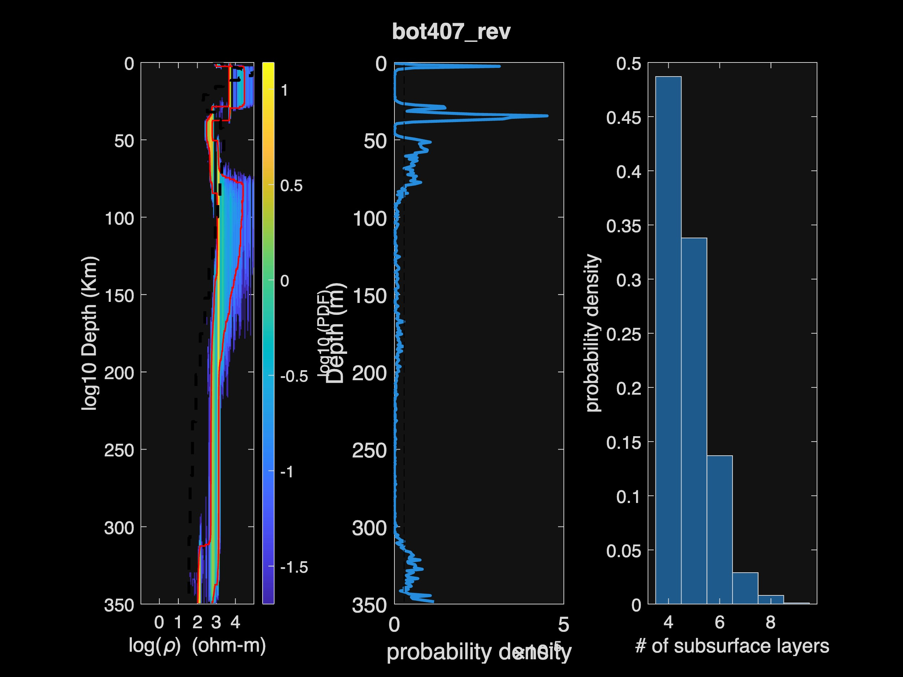
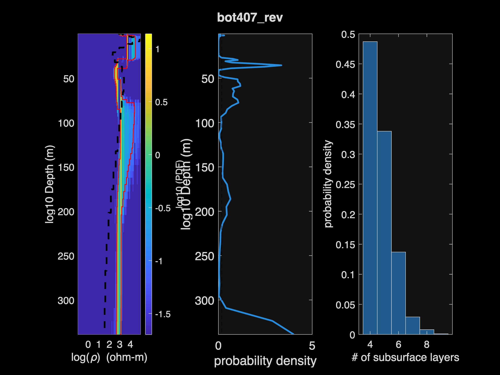
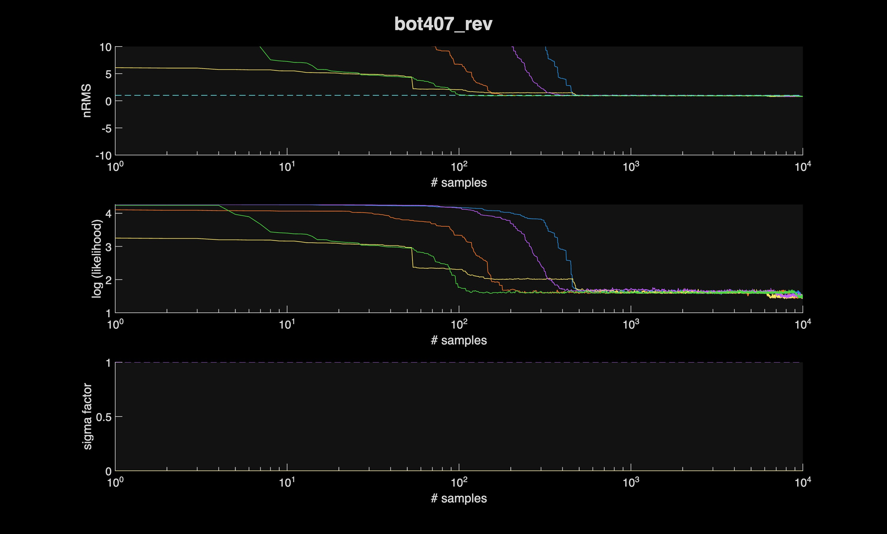

# 1D Transdimensional Bayesian Inversion of MT Data

MATLAB implementation of a 1D transdimensional (reversible-jump) Bayesian
inversion for magnetotelluric (MT) data, applied to lithospheric studies of
southern Africa (SAMTEX). The number of subsurface layers, layer
resistivities, and the noise hyperparameter are all sampled jointly, so the
posterior reflects both model and data uncertainty.

## Repository layout

```
Bayesian_1D_MTDC_J_looped.m   Driver: runs the rj-MCMC inversion per station
run_all_processing.m           Driver: post-processes chains -> figures
sites_required.dat             List of station codes to invert
MT_DC_function/                Forward modelling + MCMC kernels
Process_All_Chains/            Chain diagnostics, posterior plots, cross-plots
create_dataset_SAMTEX/         Build observed-data .dat files from SAMTEX
create_dataset_USA/            Same, for the USA test dataset
data/observed_data/            Per-station MT response files (*.dat)
data/model_1D/                 Optional reference 1D models for overlay
output/inversions/<station>/   Raw MCMC chains (one folder per station)
output/results/<station>/      Processed chains + diagnostic JPEGs
progress_log.txt               Running log of changes
```

`data/` and `output/` are gitignored.

## How to run

1. Put each station's MT response in `data/observed_data/<station>.dat` and
   list the station codes (one per line) in `sites_required.dat`.
2. Run the inversion:
   ```matlab
   Bayesian_1D_MTDC_J_looped
   ```
   This writes chain files to `output/inversions/<station>/`.
3. Process the chains and produce figures:
   ```matlab
   run_all_processing
   ```
   This writes processed `.mat` files and station-prefixed JPEGs to
   `output/results/<station>/`.

If a `data/model_1D/<station>_model_1D.mat` file is present, the reference
1D model is overlaid on the posterior plots.

## Example results (station bot407_rev)

Posterior resistivity-depth distribution, interface PDF, and number-of-layers histogram:



Same on a log-spaced depth axis:



Per-chain convergence diagnostics (nRMS, log-likelihood, sigma factor):



## Author

Shailesh Parvadiya — MSc dissertation work on Bayesian inversion of
magnetotelluric data over the southern African lithosphere.
